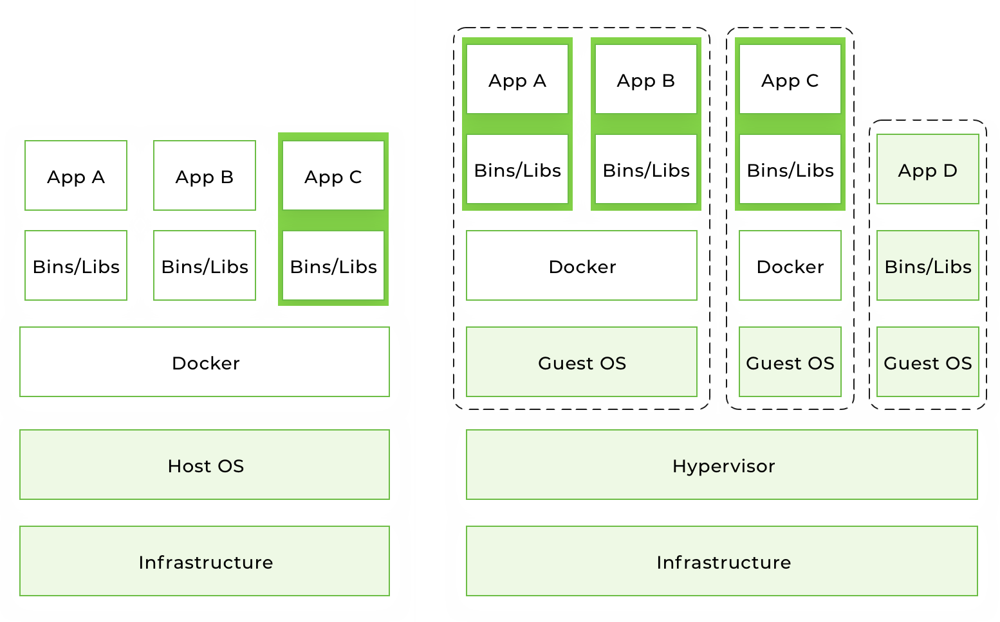
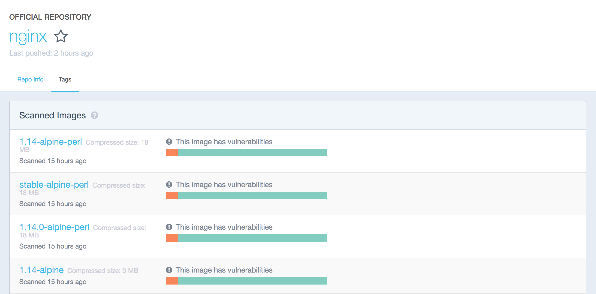

# What is Docker and How to Use it With Python (Tutorial)

This is an introductory tutorial on Docker containers. By the end of this article, you will know how to use Docker on your local machine. Along with Python, we are going to run Nginx and Redis containers. Those examples assume that you are familiar with the basic concepts of those technologies. There will be lots of shell examples, so go ahead and open the terminal.

## Table of contents

* [What is Docker?](#what-is-docker)
* [How does it differ from virtualization?](#how-does-it-differ-from-virtualization)
* [Why do we need Docker?](#why-do-we-need-docker)
* [Installation](#installation)
* [Terminology](#terminology)
* [Example: hello world](#example-1-hello-world)
* [Conclusion](#conclusion)

## What is Docker?

[Docker](https://www.docker.com/) is an open-source tool that automates the deployment of an application inside a software container.
The easiest way to grasp the idea behind Docker is to compare it to, well... standard shipping containers.

Back in the day, transportation companies faced the following challenges:

* How to transport different (incompatible) types of goods side by side (like food and chemicals, or glass and bricks).
* How to handle packages of various sizes using the same vehicle.

After the introduction of containers, bricks could be put over glass, and chemicals could be stored next to food. Cargo of various sizes can be put inside a standardized container and loaded/unloaded by the same vehicle.

Let's go back to **containers in software development**.

When you develop an application, you need to provide your code along with all possible dependencies like libraries, the web server, databases, etc. You may end up in a situation when the application is working on your computer, but won't even start on the staging server, or the dev or QA's machine.

This challenge can be addressed by isolating the app to make it independent of the system.

## How does it differ from virtualization?

Traditionally, virtual machines were used to avoid this unexpected behavior. The main problem with VM is that an “extra OS” on top of the host operating system adds gigabytes of space to the project. Most of the time your server will host several VMs that will take up even more space. And by the way, at the moment, most cloud-based server providers will charge you for that extra space. Another significant drawback of VM is a slow boot.

Docker eliminates all the above by simply sharing the OS kernel across all the containers running as separate processes of the host OS.



Keep in mind that Docker is not the first and not the only containerization platform. However, at the moment Docker is the biggest and the most powerful player on the market.

## Why do we need Docker?

The short list of benefits includes:

* Faster development process
* Handy application encapsulation
* Same behaviour on local machine / dev / staging / production servers
* Easy and clear monitoring
* Easy to scale

### Faster development process

There is no need to install 3rd-party apps like PostgreSQL, Redis, Elasticsearch on the system -- you can run it in containers. Docker also gives you the ability to run different versions of same application simultaneously. For example, say you need to do some manual data migration from an older version of Postgres to a newer version. You can have such a situation in microservice architecture when you want to create a new microservice with a new version of the 3rd-party software.

It could be quite complex to keep two different versions of the same app on one host OS. In this case, Docker containers could be a perfect solution –- you receive isolated environments for your applications and 3rd-parties.

### Handy application encapsulation

You can deliver your application in one piece. Most programming languages, frameworks and all operating systems have their own packaging managers. And even if your application can be packed with its native package manager, it could be hard to create a port for another system.

Docker gives you a unified image format to distribute you applications across different host systems and cloud services. You can deliver your application in one piece with all the required dependencies (included in an image) ready to run.

### Same behaviour on local machine / dev / staging / production servers

Docker can't guarantee 100% dev / staging / production parity, because there is always the human factor. But it reduces to almost zero the probability of error caused by different versions of operating systems, system-dependencies, etc.

With right approach to building Docker images, your application will use the same base image with the same OS version and the required dependencies.

### Easy and clear monitoring

Out of the box, you have a unified way to read log files from all running containers. You don't need to remember all the specific paths where your app and its dependencies store log files and write custom hooks to handle this.

You can integrate an [external logging driver](https://docs.docker.com/config/containers/logging/configure/#supported-logging-drivers) and monitor your app log files in one place.

### Easy to scale

A correctly wrapped application will cover most of the [Twelve Factors](https://12factor.net/). By design, Docker forces you follow its core principles, such as configuration over environment variables, communication over TCP/UDP ports, etc. And if you've done your application right, it will be ready for scaling not only in Docker.

## Installation

You can check out the installation instructions for Docker [here](https://docs.docker.com/install/).

### Install Docker

If Docker is not installed, you need to install Docker.
At a command prompt type:

```
$ docker -v
sh: docker: command not found
```

If you get this message then you need to install Docker.

Here you will find the instructions for installing Docker

* on a Mac: <a href="https://docs.docker.com/docker-for-mac/install/" target="_blank">Install Docker Desktop for Mac</a> (or alternatively good instructions  <a href="https://runnable.com/docker/install-docker-on-macos" target="_blank">here</a>). Note that only the newest versions of the Mac OS are supported and you will need at least 4GB of RAM.
* on Windows: <a href="https://docs.docker.com/docker-for-windows/install/" target="_blank">Install Docker Desktop on Windows</a>. Requirements: Windows 10 with 64 bit processor and at least 4GB of RAM.
* on Linux: <a href="https://docs.docker.com/install/linux/docker-ce/ubuntu/" target="_blank">Ubuntu</a>, <a href="https://docs.docker.com/install/linux/docker-ce/centos/" target="_blank">Centos</a>, etc.


### After installation, check Docker version

```
$ docker -v
Docker version 1.13.1, build 07f3374/1.13.1
```
This is really just to check that Docker is installed.
## Terminology

* **Container** -- a running instance that encapsulates required software. Containers are always created from images. A container can expose ports and volumes to interact with other containers or/and the outer world. Containers can be easily killed / removed and re-created again in a very short time. Containers don't keep state.

* **Image** -- the basic element for every container. When you create an image, every step is cached and can be reused ([Copy On Write model](https://en.wikipedia.org/wiki/Copy-on-write)). Depending on the image, it can take some time to build. Containers, on the other hand, can be started from images right away.

* **Port** -- a TCP/UDP port in its original meaning. To keep things simple, let's assume that ports can be exposed to the outer world (accessible from the host OS) or connected to other containers –- i.e., accessible only from those containers and invisible to the outer world.

* **Volume** -- can be described as a shared folder. Volumes are initialized when a container is created. Volumes are designed to persist data, independent of the container's lifecycle.

* **Registry** – the server that stores Docker images. It can be compared to Github – you can pull an image from the registry to deploy it locally, and push locally built images to the registry.

* [**Docker hub**](https://hub.docker.com/explore/) -- a registry with web interface provided by Docker Inc. It stores a lot of Docker images with different software. Docker Hub is a source of the "official" Docker images made by the Docker team or in cooperation with the original software manufacturer (it doesn't necessary mean that these "original" images are from official software manufacturers). Official images list their potential vulnerabilities. This information is available to any logged-in user. There are both free and paid accounts available. You can have one private image per account and an infinite amount of public images for free. [**Docker Store**](https://store.docker.com/search?type=image&source=verified) -- a service very similar to Docker Hub. It's a marketplace with ratings, reviews, etc. My personal opinion is that it's marketing stuff. I'm totally happy with Docker Hub.



## Example: hello world

It's time to run your first container:

```bash
docker run ubuntu /bin/echo 'Hello world'
```

Console output:

```
Unable to find image 'ubuntu:latest' locally
latest: Pulling from library/ubuntu
6b98dfc16071: Pull complete
4001a1209541: Pull complete
6319fc68c576: Pull complete
b24603670dc3: Pull complete
97f170c87c6f: Pull complete
Digest: sha256:5f4bdc3467537cbbe563e80db2c3ec95d548a9145d64453b06939c4592d67b6d
Status: Downloaded newer image for ubuntu:latest
Hello world
```

* **docker run** is a command to run a container.
* **ubuntu** is the image you run. For example, the Ubuntu operating system image. When you specify an image, Docker looks first for the image on your Docker host. If the image does not exist locally, then the image is pulled from the public image registry -- Docker Hub.
* **/bin/echo 'Hello world'** is the command that will run inside a new container. This container simply prints “Hello world” and stops the execution.

Let's try to create an interactive shell inside a Docker container:

```bash
docker run -i -t --rm ubuntu /bin/bash
```

* **-t** flag assigns a pseudo-tty or terminal inside the new container.
* **-i** flag allows you to make an interactive connection by grabbing the standard input (STDIN) of the container.
* **--rm** flag automatically removes the container when the process exits. By default, containers are not deleted. This container exists until we keep the shell session and terminates when we exit the session (like an SSH session with a remote server).

If you want to keep the container running after the end of the session, you need to daemonize it:

```bash
docker run --name daemon -d ubuntu /bin/sh -c "while true; do echo hello world; sleep 1; done"
```

* **--name daemon** assigns daemon name to a new container. If you don't specify a name explicitly, Docker will generate and assign it automatically.
* **-d** flag runs the container in the background (i.e., daemonizes it).

Let's see what containers we have at the moment:

```bash
docker ps -a
```

Console output:

```
CONTAINER ID  IMAGE   COMMAND                 CREATED             STATUS                         PORTS  NAMES
1fc8cee64ec2  ubuntu  "/bin/sh -c 'while..."  32 seconds ago      Up 30 seconds                         daemon
c006f1a02edf  ubuntu  "/bin/echo 'Hello ..."  About a minute ago  Exited (0) About a minute ago         gifted_nobel
```

* **docker ps** is a command to list containers.
* **-a** shows all containers (without -a flag ps will show only running containers).

The **ps** shows us that we have two containers:

* **gifted_nobel** (the name for this container was generated automatically – it will be different on your machine). It's the first container we created, the one that printed 'Hello world' once.
* **daemon** -- the third container we created, which runs as a daemon.

Note: there is no second container (the one with interactive shell) because we set the **--rm option**. As a result, this container is automatically deleted right after execution.

Let's check the logs and see what the daemon container is doing right now:

```bash
docker logs -f daemon
```

Console output:

```
...
hello world
hello world
hello world
```

* **docker logs** fetch the logs of a container.
* **-f** flag to follow the log output (works actually like **tail -f**).

Now let's stop the daemon container:

```bash
docker stop daemon
```

Make sure the container has stopped.

```bash
docker ps -a
```

Console output:

```
CONTAINER ID  IMAGE   COMMAND                 CREATED        STATUS                      PORTS  NAMES
1fc8cee64ec2  ubuntu  "/bin/sh -c 'while..."  5 minutes ago  Exited (137) 5 seconds ago         daemon
c006f1a02edf  ubuntu  "/bin/echo 'Hello ..."  6 minutes ago  Exited (0) 6 minutes ago           gifted_nobel
```

The container is stopped. We can start it again:

```bash
docker start daemon
```

Let's ensure that it's running:

```bash
docker ps -a
```

Console output:

```
CONTAINER ID  IMAGE   COMMAND                 CREATED        STATUS                    PORTS  NAMES
1fc8cee64ec2  ubuntu  "/bin/sh -c 'while..."  5 minutes ago  Up 3 seconds                     daemon
c006f1a02edf  ubuntu  "/bin/echo 'Hello ..."  6 minutes ago  Exited (0) 7 minutes ago         gifted_nobel
```

Now, stop it again and remove all the containers manually:

```
docker stop daemon
docker rm <your first container name>
docker rm daemon
```

To remove all containers, we can use the following command:

```bash
docker rm -f $(docker ps -aq)
```

* **docker rm** is the command to remove the container.
* **-f** flag (for rm) stops the container if it's running (i.e., force deletion).
* **-q** flag (for ps) is to print only container IDs.


## Conclusion

To summarize this tutorial, alongside with IDE and Git, Docker has become a must-have developer tool. It's a production-ready tool with a rich and mature infrastructure.

Docker can be used on all types of projects, regardless of size and complexity. In the beginning, you can start with [compose](https://docs.docker.com/compose/overview/) and [Swarm](https://docs.docker.com/engine/swarm/). When the project grows, you can migrate to cloud services like [Amazon Container Services](https://aws.amazon.com/containers/) or [Kubernetes](https://kubernetes.io/).

Like standard containers used in cargo transportation, wrapping your code in Docker containers will help you build faster and more efficient CI/CD processes. This is not just another technological trend promoted by a bunch of geeks –- it's a new paradigm that is already being used in the architecture of large companies like [PayPal](https://blog.docker.com/2017/12/containers-at-paypal/), [Visa](https://blog.docker.com/2017/04/visa-inc-gains-speed-operational-efficiency-docker-enterprise-edition/), [Swisscom](https://www.docker.com/customers/swisscom-goes-400vms-20vms-docker), [General Electric](https://www.docker.com/customers/ge-uses-docker-enable-self-service-their-developers), [Splink](https://www.docker.com/customers/docker-datacenter-delivers-splunks-house-demos), etc.
